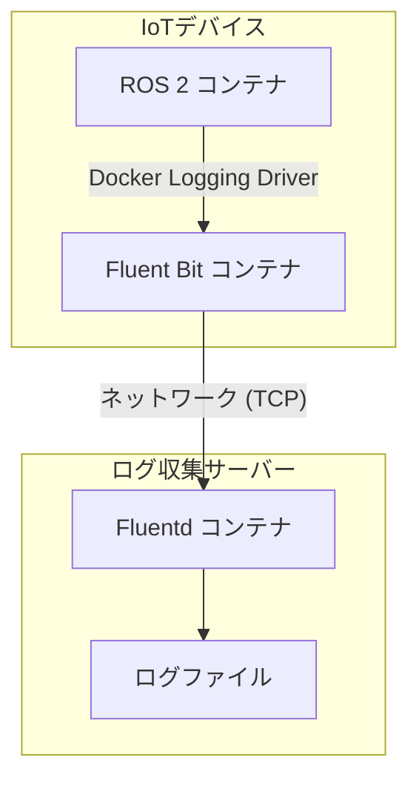

```mermaid
graph TD
    subgraph IoTデバイス
        A[ROS 2 コンテナ] -- Docker Logging Driver --> B[Fluent Bit コンテナ]
    end
    subgraph ログ収集サーバー
        C[Fluentd コンテナ] --> D[ログファイル]
    end
    B -- ネットワーク (TCP) --> C
```