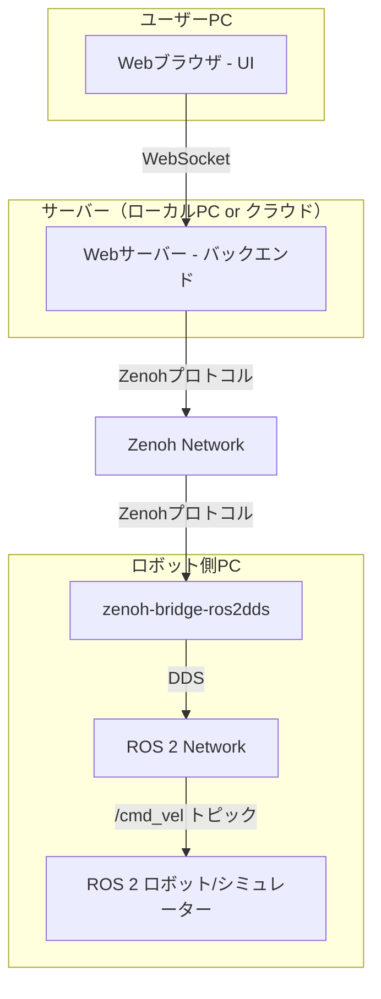

```mermaid
graph TD
    A[Webブラウザ - UI] -- WebSocket --> B[Webサーバー - バックエンド];
    B -- Zenohプロトコル --> C[Zenoh Network];
    C -- Zenohプロトコル --> D[zenoh-bridge-ros2dds];
    D -- DDS --> E[ROS 2 Network];
    E -- /cmd_vel トピック --> F[ROS 2 ロボット/シミュレーター];

    subgraph "ユーザーPC"
        A
    end

    subgraph "サーバー（ローカルPC or クラウド）"
        B
    end

    subgraph "ロボット側PC"
        D
        E
        F
    end
```